# GestorPro — Sistema de Gestión de Proyectos Colaborativos

**Materia:** INF560 — Desarrollo Web Backend   
**Docente:** M. Sc. Huáscar Fedor Gonzales Guzmán  
**Estudiante:** Clyder Remmy Moreira Quispe  
**Arquitectura:** Aplicación monolítica (Laravel 13 + Blade)

---

## Descripción

GestorPro es una aplicación web monolítica para la gestión de proyectos colaborativos. Permite crear proyectos, gestionar tareas con estados y prioridades, agregar miembros con roles en el pivote, y colaborar mediante comentarios. El sistema implementa autenticación por sesión, control de acceso por roles y permisos con `spatie/laravel-permission`, y autorización por pertenencia mediante Policies.

---

## Stack Tecnológico

|      Componente      |              Tecnología               |
|----------------------|---------------------------------------|
| Framework            | Laravel 13                            |
| Lenguaje             | PHP 8.3                               |
| Base de datos        | PostgreSQL                            |
| Autenticación        | Laravel Breeze (sesión nativa)        |
| Roles y permisos     | spatie/laravel-permission ^7.0        |
| Vistas               | Blade (layouts, components, partials) |
| Validación           | Form Requests                         |
| Frontend             | Tailwind CSS + Vite                   |
| Control de versiones | Git (entrega por fases con tags)      |

---

## Requisitos Previos

- PHP 8.3 o superior
- Composer
- Node.js y NPM
- PostgreSQL
- Git

---

## Instalación

### 1. Clonar el repositorio

```bash
git clone https://github.com/Remmy002/gestorpro.git
cd gestorpro
```

### 2. Instalar dependencias PHP

```bash
composer install
```

### 3. Instalar dependencias frontend

```bash
npm install
npm run build
```

### 4. Configurar el archivo de entorno

```bash
cp .env.example .env
php artisan key:generate
```

### 5. Configurar la base de datos en `.env`

```env
DB_CONNECTION=pgsql
DB_HOST=127.0.0.1
DB_PORT=5432
DB_DATABASE=gestorpro
DB_USERNAME=tu usuario
DB_PASSWORD=tu_password
```

### 6. Crear la base de datos en PostgreSQL

Abre pgAdmin y crea una base de datos llamada `gestorpro`.

### 7. Ejecutar migraciones y seeders

```bash
php artisan migrate
php artisan db:seed
```

### 8. Levantar el servidor

```bash
php artisan serve
```

Accede en: `http://localhost:8000`

---

## Credenciales Semilla

Todos los usuarios tienen la misma contraseña: `password`

|      Nombre      |           Email           | Rol         |
|------------------|---------------------------|-------------|
| Administrador    | admin@gestorpro.com       | admin       |
| Líder Demo       | lider@gestorpro.com       | lider       |
| Colaborador Demo | colaborador@gestorpro.com | colaborador |
| Invitado Demo    | invitado@gestorpro.com    | invitado    |

---

## Roles y Permisos

### Tabla de roles

|     Rol     |                          Descripción                          |
|-------------|---------------------------------------------------------------|
| admin       | Acceso total al sistema. Gestiona usuarios y asigna roles.    |
| lider       | Crea y gestiona sus proyectos, tareas y miembros.             |
| colaborador | Ve proyectos donde es miembro, crea y edita tareas asignadas. |
| invitado    | Solo lectura en proyectos asignados. Puede comentar.          |

### Tabla de permisos por rol

|       Permiso      | admin | lider | colaborador | invitado |
|--------------------|:-----:|:-----:|:-----------:|:--------:|
| ver proyecto       |  ✅  |   ✅  |     ✅     |    ✅    |
| crear proyecto     |  ✅  |   ✅  |     ❌     |    ❌    |
| editar proyecto    |  ✅  |   ✅  |     ❌     |    ❌    |
| eliminar proyecto  |  ✅  |   ✅  |     ❌     |    ❌    |
| gestionar miembros |  ✅  |   ✅  |     ❌     |    ❌    |
| crear tarea        |  ✅  |   ✅  |     ✅     |    ❌    |
| editar tarea       |  ✅  |   ✅  |     ✅     |    ❌    |
| eliminar tarea     |  ✅  |   ✅  |     ❌     |    ❌    |
| asignar tarea      |  ✅  |   ✅  |     ❌     |    ❌    |
| comentar           |  ✅  |   ✅  |     ✅     |    ✅    |
| gestionar usuarios |  ✅  |   ❌  |     ❌     |    ❌    |

### Autorización por pertenencia (Policies)

Además de los permisos por rol, el sistema aplica una segunda capa de autorización por pertenencia:

- Un **líder** solo puede editar o eliminar **sus propios proyectos** (`owner_id`).
- Un **colaborador** solo puede editar tareas que le están **asignadas** (`assignee_id`).
- Un **comentario** solo puede ser eliminado por su **autor** o por el admin.

---

## Modelo de Datos

users
├── id, name, email, password
├── N:M projects (pivot: project_user → project_role)
├── 1:N tasks (assignee_id)
└── 1:N comments
projects
├── id, nombre, descripcion, estado, owner_id
├── 1:N tasks
└── N:M users (pivot: project_user)
tasks
├── id, titulo, descripcion, estado, prioridad, due_date
├── project_id (N:1 projects)
├── assignee_id (N:1 users)
└── 1:N comments
comments
├── id, cuerpo
├── user_id (N:1 users)
└── task_id (N:1 tasks)
project_user (pivote N:M)
├── project_id
├── user_id
└── project_role (lider | colaborador | invitado)

---

## Fases de Desarrollo

|  Tag   |     Fase      |                                     Contenido                                       |
|--------|---------------|-------------------------------------------------------------------------------------|
| `v0.1` | Cimientos     | Migraciones, modelos, relaciones, factories y seeders del dominio                   |
| `v0.2` | Autenticación | Login/registro por sesión, CSRF, layout privado, dashboard por rol                  |
| `v0.3` | RBAC          | spatie: roles/permisos, Policies, panel de administración de usuarios               |
| `v0.4` | CRUD completo | Proyectos, tareas anidadas, comentarios, miembros (N:M), Form Requests, soft delete |
| `v1.0` | Calidad y UX  | Filtros, paginación, errores 403/404, vistas pulidas, README                        |

---

## Funcionalidades Principales

- ✅ Registro e inicio de sesión con autenticación por sesión y protección CSRF
- ✅ Panel privado protegido con middleware `auth`
- ✅ CRUD de proyectos con control de permisos y pertenencia
- ✅ Gestión de miembros con rol en tabla pivote (`attach`, `detach`, `syncWithoutDetaching`)
- ✅ CRUD de tareas anidadas con estado, prioridad, fecha límite y responsable
- ✅ Cambio de estado y reasignación de tareas
- ✅ Comentarios en tareas para miembros e invitados
- ✅ Panel de administración para gestionar usuarios y asignar roles
- ✅ Filtros por estado y prioridad con paginación
- ✅ Validación con Form Requests y mensajes flash
- ✅ Páginas de error 403 y 404 personalizadas
- ✅ Control `@can` / `@role` en todas las vistas

---


## Capturas de Pantalla

### Login
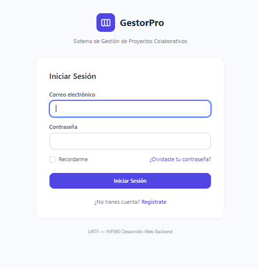

### Dashboard por Rol
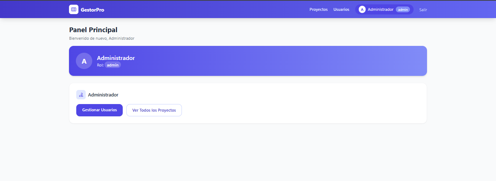
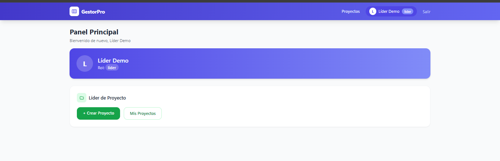
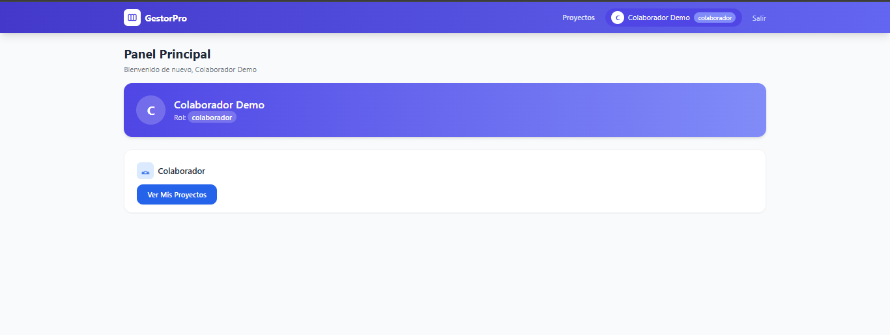
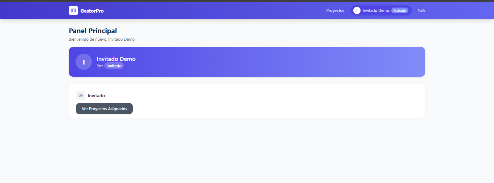

### Gestión de Usuarios (Admin)
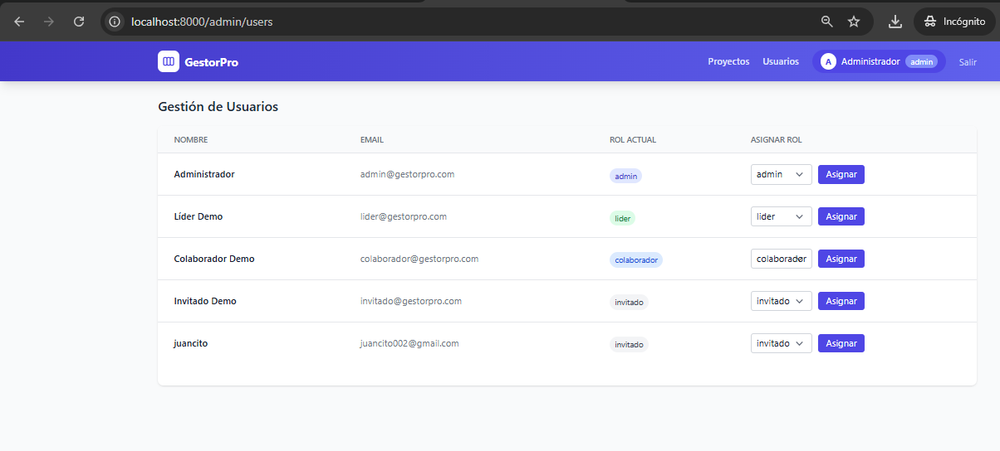

### Proyectos
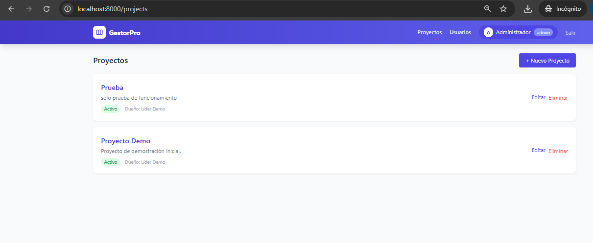
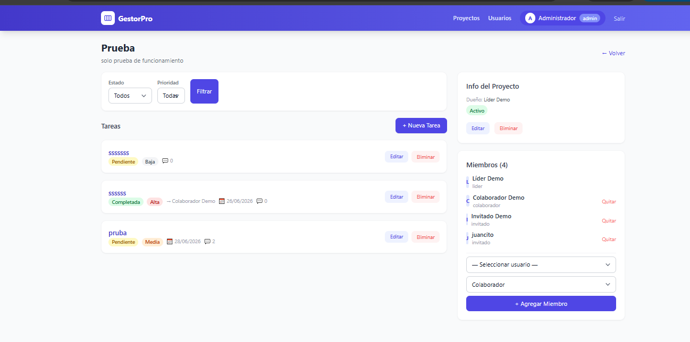
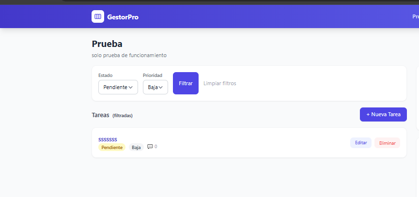

### Tareas
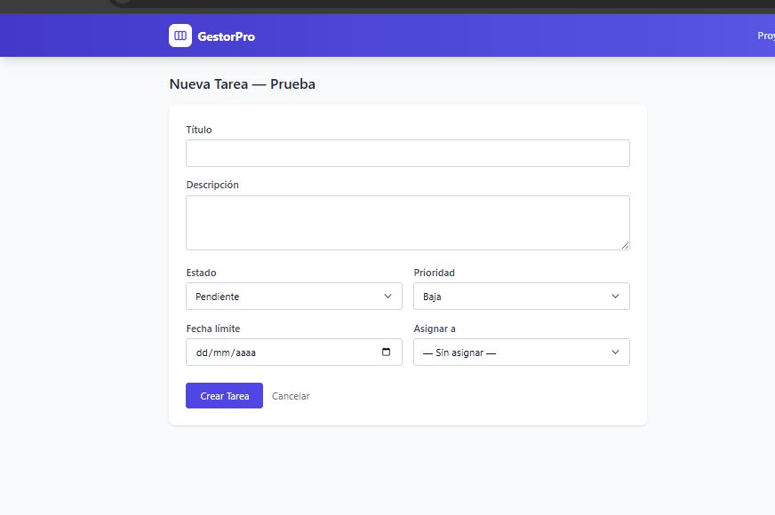
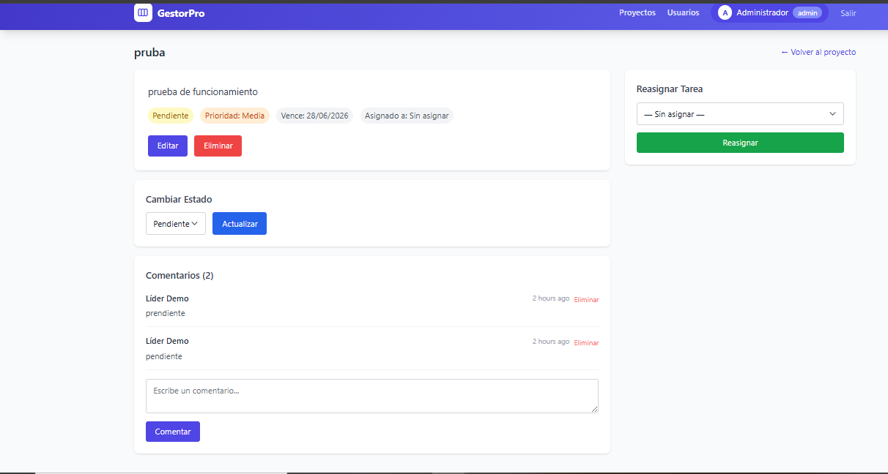

### UX
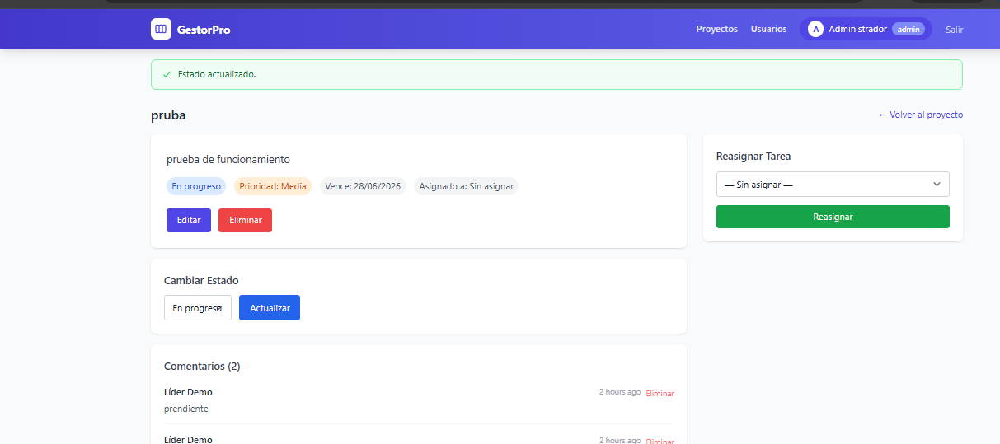
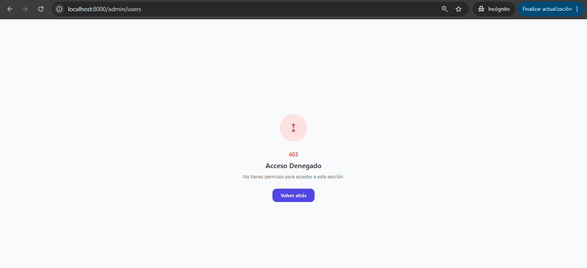
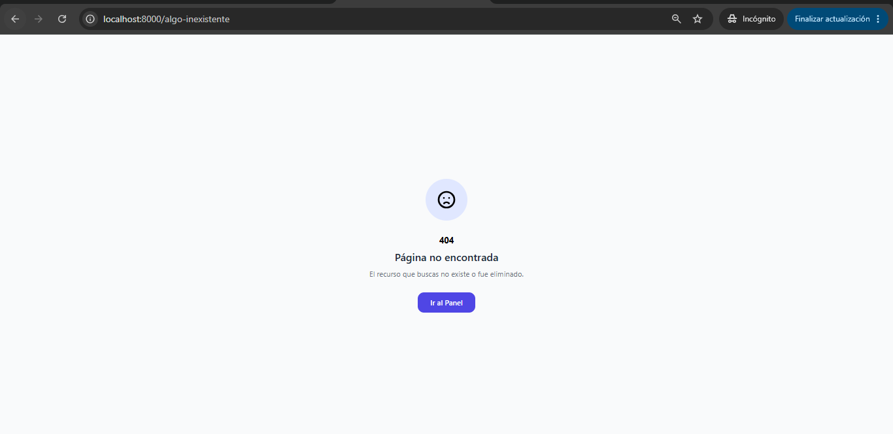